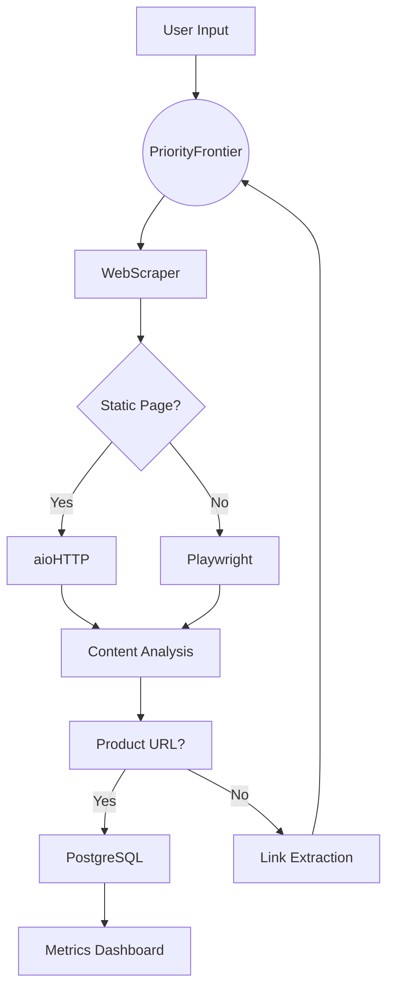
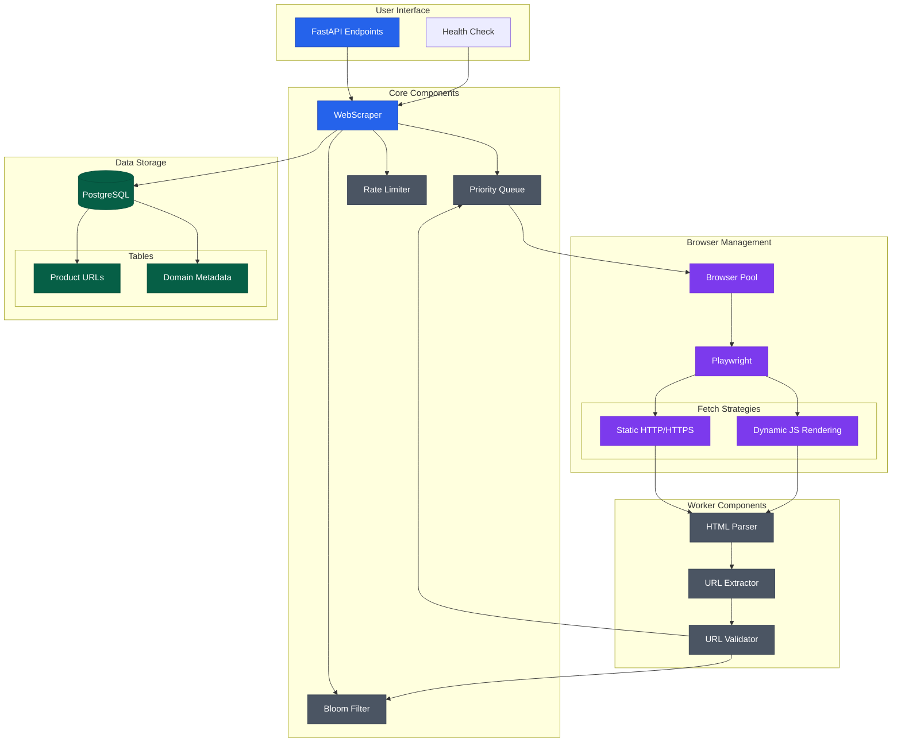

# Web Scraper: Product URL Crawler

A high-performance web crawler designed to extract product URLs from e-commerce websites. Built with Python,
asynchronous I/O, and PostgreSQL for scalable data storage.

---

## Table of Contents

1. [Description](#1-description)
2. [Features](#2-features)
3. [Architecture](#3-architecture)
    - [Detailed System Architecture](#detailed-system-architecture)
    - [Coding Architecture (LLD)](#coding-architecture-lld)
    - [System Flow (HLD)](#system-flow-hld)
4. [Installation](#4-installation)
    - [Local Setup](#local-setup)
    - [Docker Setup](#docker-setup)
5. [Usage](#5-usage)
6. [API Endpoints](#6-api-endpoints)
7. [Future Steps](#7-future-steps)

---

## 1. Description

This crawler efficiently scrapes product URLs from websites using:

- **Hybrid Fetching**: Static pages (HTTP) + dynamic pages (Playwright browser automation).
- **Priority Queue**: Prioritizes URLs matching product page patterns (e.g., `/p/`, `/dp/`, `p-`, `/buy`).
- **Bloom Filter**: Tracks visited URLs to avoid redundant requests.
- **Rate Limiting**: Respects domain crawl delays (configurable per domain).
- **PostgreSQL**: Stores extracted URLs with domain metadata.

---

## 2. Features

- 🚀 **Asynchronous Crawling**: Leverages `asyncio` for concurrent requests.
- 🕸️ **JavaScript Rendering**: Uses Playwright for Single-Page Applications (SPAs).
- 📊 **Metrics Tracking**: Monitors URLs crawled, errors, and product URLs found.
- 🛠️ **Resilient Retries**: Auto-retry failed requests with exponential backoff.
- 🐳 **Dockerized**: Preconfigured PostgreSQL and app containers.

---

## 3. Architecture

### System Flow (HLD)



### Coding Architecture (LLD)

| Component           | Description                                                           |
|---------------------|-----------------------------------------------------------------------|
| `WebScraper`        | Orchestrates crawling, URL processing, and database batch inserts.    |
| `PriorityFrontier`  | Manages URL queues (high/medium/low priority) for efficient crawling. |
| `BrowserPool`       | Pool of Chromium instances for parallel headless browsing.            |
| `VisitedURLTracker` | Uses a Bloom filter + in-memory set to track visited URLs.            |
| `DomainRateLimiter` | Enforces per-domain crawl delays to avoid IP bans.                    |
| `AsyncPostgres`     | Async PostgreSQL client for bulk inserts and connection pooling.      |
| `ETL`               | Initializes database tables and manages schema migrations.            |

### Detailed System Architecture


## 4. Installation

### Prerequisites

- Python 3.8+
- PostgreSQL 13+
- Playwright browsers

### Local Setup

1. Clone the repository:
   ```bash
   git clone https://github.com/makkarss929/WEB_CRAWLER.git
   ```

2. Create and activate a virtual environment:
   ```bash
   python -m venv venv
   source venv/bin/activate  # Linux/Mac
   # or
   .\venv\Scripts\activate  # Windows
   ```

3. Install dependencies:
   ```bash
   pip install -r requirements.txt
   ```

4. Install Playwright browsers:
   ```bash
   playwright install
   ```

5. Create a `.env` file with database configuration:
   ```
   DATABASE_HOST=localhost
   DATABASE_PORT=5432
   DATABASE_USER=admin
   DATABASE_PASSWORD=your_password
   DATABASE_NAME=crawler_db
   ```

6. Start the app:
   ```
   python -u app.py
   ```

### Docker Setup

1. Make sure Docker and Docker Compose are installed.

2. Create a `.env` file as described above.

3. Build and start the containers:
   ```bash
   docker compose up -d
   ```

## 5. Usage

### Making API Requests

```python
import requests

# Start a crawl
response = requests.post(
    "http://localhost:5001/crawl",
    json={
        "domains": [
            "https://www.flipkart.com/", "https://www.limeroad.com/"
        ]
    }
)

# Check health
health = requests.get("http://localhost:5001/")
```

## 6. API Endpoints

- `GET /` - Health check endpoint
    - Returns: `{"status": "ok", "active_scrapers": <count>}`

- `POST /crawl` - Start crawling specified domains
    - Body: `{"domains": ["domain1.com", "domain2.com"]}`
    - Returns: `{"metrics": {
            'urls_crawled': 0,
            'product_urls': 0,
            'avg_response_time': 0,
            'error_rate': 0
        }`

## 7. Future Steps

### Planned Architecture Upgrades

#### 1. RabbitMQ & Celery Integration

- **Distributed Task Queue**: Use RabbitMQ for message brokering and Celery workers for parallel task processing.

#### 2. Redis for Distributed State

- **Bloom Filter Replacement**: Use RedisBloom for distributed URL tracking.

#### 3. Monitoring & Metrics

- **Flower Dashboard**: Real-time monitoring of Celery tasks.

### 4. Horizontal Scaling

- **Kubernetes Deployment**: Auto scaling

## License

This project is licensed under the MIT License - see the LICENSE file for details.