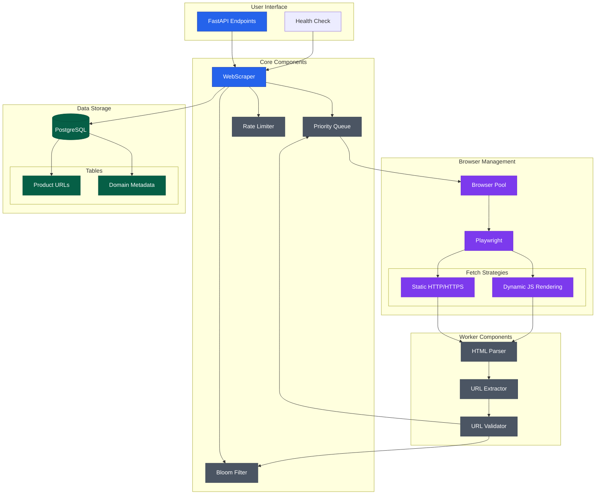
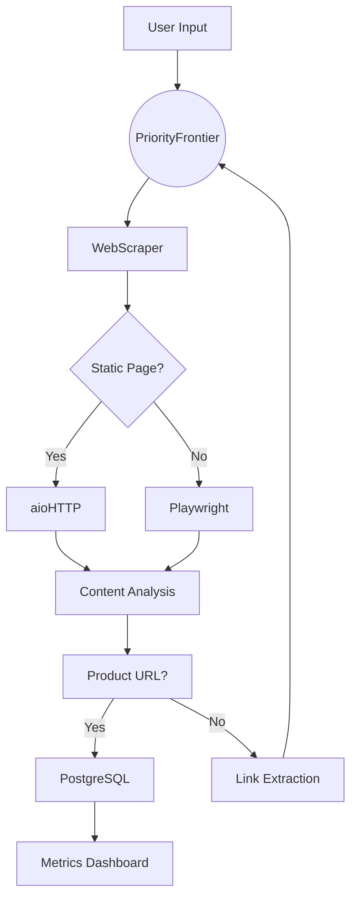

# Web Scraper: Product URL Crawler

A high-performance web crawler designed to extract product URLs from e-commerce websites. Built with Python, asynchronous I/O, and PostgreSQL for scalable data storage.

---

## Table of Contents
1. [Description](#1-description)
2. [Features](#2-features)
3. [Architecture](#3-architecture)
   - [Detailed System Architecture](#detailed-system-architecture)
   - [Coding Architecture (LLD)](#coding-architecture-lld)
   - [System Flow (HLD)](#system-flow-hld)
4. [Installation](#4-installation)
   - [Local Setup](#local-setup)
   - [Docker Setup](#docker-setup)
5. [Usage](#5-usage)
6. [API Endpoints](#6-api-endpoints)
7. [Database Schema](#7-database-schema)
8. [Contributing](#8-contributing)

---

## 1. Description
This crawler efficiently scrapes product URLs from websites using:
- **Hybrid Fetching**: Static pages (HTTP) + dynamic pages (Playwright browser automation).
- **Priority Queue**: Prioritizes URLs matching product page patterns (e.g., `/p/`, `/dp/`).
- **Bloom Filter**: Tracks visited URLs to avoid redundant requests.
- **Rate Limiting**: Respects domain crawl delays (configurable per domain).
- **PostgreSQL**: Stores extracted URLs with domain metadata.

---

## 2. Features
- 🚀 **Asynchronous Crawling**: Leverages `asyncio` for concurrent requests.
- 🕸️ **JavaScript Rendering**: Uses Playwright for Single-Page Applications (SPAs).
- 📊 **Metrics Tracking**: Monitors URLs crawled, errors, and product URLs found.
- 🛠️ **Resilient Retries**: Auto-retry failed requests with exponential backoff.
- 🐳 **Dockerized**: Preconfigured PostgreSQL and app containers.

---

## 3. Architecture

### Detailed System Architecture



### Coding Architecture (LLD)
| Component               | Description                                                                 |
|-------------------------|-----------------------------------------------------------------------------|
| `WebScraper`            | Orchestrates crawling, URL processing, and database batch inserts.         |
| `PriorityFrontier`      | Manages URL queues (high/medium/low priority) for efficient crawling.      |
| `BrowserPool`           | Pool of Chromium instances for parallel headless browsing.                 |
| `VisitedURLTracker`     | Uses a Bloom filter + in-memory set to track visited URLs.                 |
| `DomainRateLimiter`     | Enforces per-domain crawl delays to avoid IP bans.                         |
| `AsyncPostgres`         | Async PostgreSQL client for bulk inserts and connection pooling.           |
| `ETL`                   | Initializes database tables and manages schema migrations.                 |

### System Flow (HLD)


## 4. Installation

### Prerequisites
- Python 3.8+
- PostgreSQL 13+
- Playwright browsers

### Local Setup
1. Clone the repository:
   ```bash
   git clone https://github.com/makkarss929/WEB_CRAWLER.git
   cd web-scraper
   ```

2. Create and activate a virtual environment:
   ```bash
   python -m venv venv
   source venv/bin/activate  # Linux/Mac
   # or
   .\venv\Scripts\activate  # Windows
   ```

3. Install dependencies:
   ```bash
   pip install -r requirements.txt
   ```

4. Install Playwright browsers:
   ```bash
   playwright install
   ```

5. Create a `.env` file with database configuration:
   ```
   DATABASE_HOST=localhost
   DATABASE_PORT=5432
   DATABASE_USER=your_user
   DATABASE_PASSWORD=your_password
   DATABASE_NAME=crawler_db
   ```

### Docker Setup
1. Make sure Docker and Docker Compose are installed.

2. Create a `.env` file as described above.

3. Build and start the containers:
   ```bash
   docker-compose up -d
   ```

## 5. Usage

### Starting the Server
```bash
# Local
uvicorn app:app --host 0.0.0.0 --port 5001

# Docker
docker-compose up
```

### Making API Requests
```python
import requests

# Start a crawl
response = requests.post(
    "http://localhost:5001/crawl",
    json={
        "domains": ["example.com", "sample.com"]
    }
)

# Check health
health = requests.get("http://localhost:5001/")
```

## 6. API Endpoints

- `GET /` - Health check endpoint
  - Returns: `{"status": "ok", "active_scrapers": <count>}`

- `POST /crawl` - Start crawling specified domains
  - Body: `{"domains": ["domain1.com", "domain2.com"]}`
  - Returns: `{"product_urls": ["url1", "url2", ...]}`

## 7. Database Schema

```sql
CREATE TABLE product_urls (
    id SERIAL PRIMARY KEY,
    url TEXT NOT NULL,
    domain TEXT NOT NULL,
    discovered_at TIMESTAMP DEFAULT CURRENT_TIMESTAMP,
    status VARCHAR(50) DEFAULT 'pending',
    metadata JSONB
);

CREATE INDEX idx_domain ON product_urls(domain);
CREATE INDEX idx_status ON product_urls(status);
```

## 8. Contributing

1. Fork the repository
2. Create a feature branch
3. Make your changes
4. Write/update tests
5. Submit a pull request

For bug reports and feature requests, please open an issue.

---

## License

This project is licensed under the MIT License - see the LICENSE file for details.